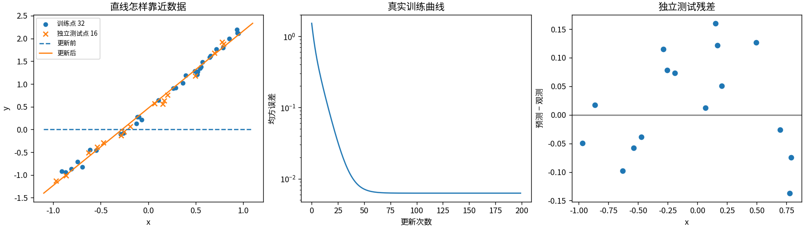
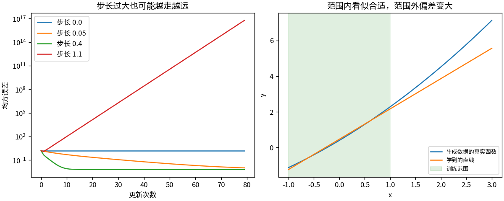

# T1 让一条直线学会调参数

## 梯度是一张局部路标

让模型写出 y = wx + b。w 决定倾斜，b 决定上下位置。“学习”就是不断微调这两个数，让预测与观测更接近。

先算一个足够小的例子：输入 x=2，目标为5，起点 w=1、b=0。预测是2，平方误差 (2−5)²=9。对 w 的导数是 2(2−5)×2=−12，对 b 的导数是 2(2−5)=−6。步长取0.1，更新为 w=2.2、b=0.6，预测恰好变成5。这个例子一步到位是数值巧合，不是训练的普遍规律。

完整数据上的损失是平均平方误差，梯度也要取平均。代码的核心仅是：先算 error = wx+b−y，再算 dw = mean(2×error×x)、db = mean(2×error)，最后从参数中减去“步长×梯度”。这里没有自动求导工具。

## 把一笔计算变成连续更新

运行 `python -m toys.t01_linear`，或 `python run_all.py --only t01`。脚本用种子42生成32个训练点和独立的16个测试点。生成函数是 1.7x+0.4+0.18x²，观测噪声标准差0.08；两组输入均在[−1,1]内。故意留下的轻微弯曲，是直线无法完全解释的部分。

200步后，实测 w=1.69727、b=0.46720；训练均方误差由1.52340降到0.006264，测试误差为0.007891。结果保存在 `outputs/t01/metrics.json`，不是写死在算法里的答案。

左图同时显示更新前后直线，中图记录每一步损失，右图只画独立测试点的误差。残差仍然存在：观测有噪声，模型也有表达限制。

步长为0时一动不动，过大时误差反而增大。训练噪声改为0.02、0.08、0.25后，固定独立测试机制测得的误差分别为0.003330、0.007891、0.048248。这里改变的是整个数据生成条件，不是同一测试集上的严格因果实验。

更要紧的是右图：在 x=3 处，直线预测5.559，真实无噪函数值7.12。模型从未见过这一区间。范围内误差小，不能保证范围外可靠。

## 哪些环节已经核对

- 手算单点的损失、两个梯度和更新结果一致
- float64 中央有限差分检查两个参数，最大绝对误差约1.21×10⁻¹¹
- 步长0时参数严格不变；同种子数据完全复现；训练与测试输入无重复
- 参数保存到 `parameters.npz` 后重新读取，预测逐元素相同

复核：`python -m unittest discover -s tests -p 'test_t01_linear.py' -v`。

这条直线没有“领悟规律”的神秘步骤。预测、误差、导数、更新，全部是可检查的数字运算；它的能力边界也藏在我们选择的函数形式里。
