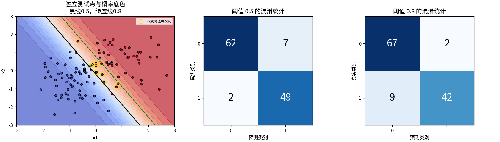
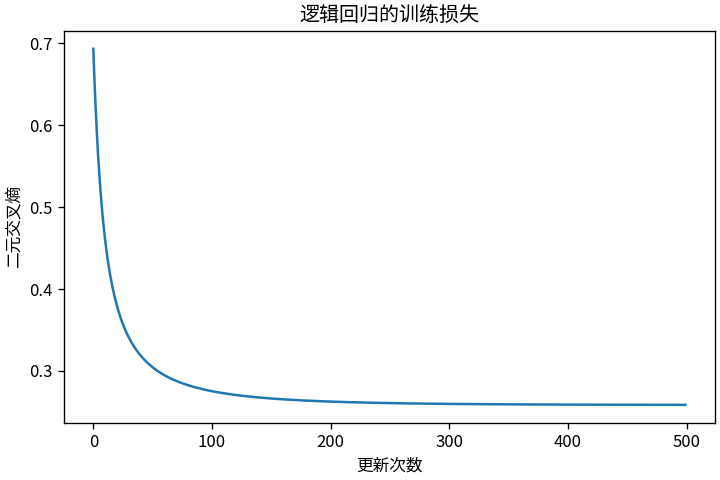

# T2 给两种小点分组的迷你分类器

## 一条线怎样变成概率

先把二维点变成分数 z=x1+x2−1，再用 sigmoid(z)=1/(1+exp(−z)) 压到0与1之间。点(0,0)的分数−1对应0.269，点(1,1)的分数1对应0.731。若阈值为0.5，前者归入0类，后者归入1类。分界线正是 x1+x2=1。

概率底色可以平滑过渡，最终决定却必须跨过一道阈值。这是两个不同步骤。把0.5改成0.8，模型参数没有变，被判为正类的点却会减少。

## 让分界线从数据中移动

运行 `python -m toys.t02_logistic`。160个训练点和120个独立测试点来自两团有重叠的高斯点，种子分别为42和1042。训练使用二元交叉熵。为避免极端数值溢出，代码直接从分数算 loss = mean(logaddexp(0,z)−y×z)，而不是先取概率再对0取对数。

链式求导后，分数梯度恰好是 (sigmoid(z)−y)/样本数。将它乘回输入，就得到权重梯度；求和得到偏置梯度。500次更新、步长0.15后，独立测试交叉熵为0.19842，准确率为92.5%。

两张混淆统计图的行是真实类别，列是预测类别。阈值0.5时，69个负类中7个误报，51个正类中2个漏报；阈值0.8时，误报降到2个，漏报增到9个，共12个点改判。提高门槛不是“更聪明”，而是交换了两种错误。

同样流程还生成了三种条件：较少重叠时测试准确率100%，明显重叠时80.83%，正类较少时93.33%。这些都是有限合成样本上的结果。正类很少时，总准确率可能掩盖漏报，所以脚本一并保留混淆统计。阈值示例是预先选定的0.5与0.8，没有用测试集搜索最优阈值。

## 这条线能承诺什么

sigmoid给出的数可用于概率模型，但这里没有做校准检验，不能把“0.93”直接宣称为现实世界93%的可靠性。单条线也分不开任意形状，例如下一篇的XOR。逻辑回归优化可微概率损失，不能与按误分类更新的感知器混称。

核对包括：零分数输出0.5；±1000极端分数仍产生有限损失与梯度；三个参数的中央有限差分最大绝对误差约3.95×10⁻¹²；训练测试点无重复；保存再读取的预测完全一致。

复核：`python -m unittest discover -s tests -p 'test_t02_logistic.py' -v`。完整数字在 `outputs/t02/metrics.json`，权重在同目录的 `parameters.npz`。
