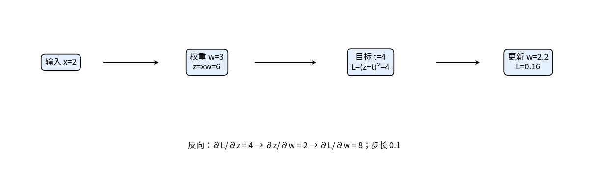
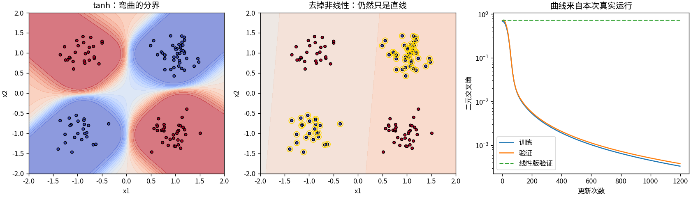
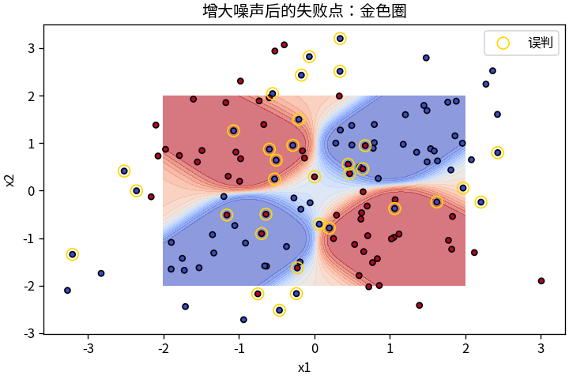

# T3 用一个小网络讲清反向传播

## 沿着计算链倒着算

输入2乘权重3，得到6；目标是4，平方误差为4。误差对输出的导数为2×(6−4)=4，输出对权重的导数为2，因此权重梯度为4×2=8。步长0.1后，权重变为2.2，输出4.4，误差降到0.16。

反向传播只是把这种“沿途相乘，分支汇合处相加”的规则铺到更多层。它传递的是导数，没有凭空创造新的学习原则。

## 17个参数，分开四个角

XOR的规则很简单：两个输入符号不同记作1，相同记作0。四个角交错分布，一条直线无法全部分开。本篇用2→4→1网络：输入乘 W1 加 b1，经过 tanh，再乘 W2 加 b2，最后得到分类分数。总计17个参数。

前向过程保留隐藏值 h。反向先从二元交叉熵得到 dz=(sigmoid(z)−y)/N，再得到 dW2=h转置×dz、dh=dz×W2转置。tanh 的导数为1−h²，所以 da=dh×(1−h²)，进而 dW1=x转置×da。偏置梯度是对应位置的求和。脚本中的这些式子都是显式NumPy运算。

运行 `python -m toys.t03_mlp`。固定种子42，隐藏权重初始标准差0.35、输出权重0.25；Adam步长0.03，训练1200步。Adam只调整怎样使用已算出的梯度，不负责求导。

四个精确XOR点单独训练后，四个预测概率约为0.000050、0.99844、0.99983、0.00161。但这只能证明拟合这四个点，不能证明泛化。

因此另一组实验分别生成128个训练点、128个验证点和128个测试点。它们的底层角点加上标准差0.22的独立噪声，三个种子为42、1042、2042，没有重复的观测向量。实测训练、验证、测试损失分别为0.000332、0.000380、0.000567；这一次128个测试点全部判对。去掉tanh、保留相同参数量的对照只有47.66%，因为两个线性层合起来仍然是线性函数。

## 让失败也露出来

把测试噪声增到0.9，准确率降为74.22%；金色圈展示误判。标签来自加噪声前的角点，噪声可能把点推到另一个区域，因此单靠坐标也不总能分清。

训练也会失败：同一种子、结构和步长，仅把两组初始权重标准差都翻倍，训练损失停在约0.31869，测试准确率66.41%。小网络也可能落到不好的解。默认较小初始化依据训练损失排查确定，这些是机制演示，不是预注册的性能基准或多种子优势证明。

## 检查怎样落到每个参数

float64中央有限差分逐个检查全部17个参数，最大绝对误差约8.54×10⁻¹²。非线性版和线性消融版都检查；另检查每层梯度形状、有限值、数据分离、相同种子复现，以及保存读取后的完全相同预测。

复核：`python -m unittest discover -s tests -p 'test_t03_mlp.py' -v`。实测结果、失败点坐标和概率在 `outputs/t03/metrics.json`。

小网络的单元是数学结构，不是对人脑神经元的完整复制。读懂这17个参数怎样更新，已经足以把“反向传播”拆成能够一项项核对的计算。
