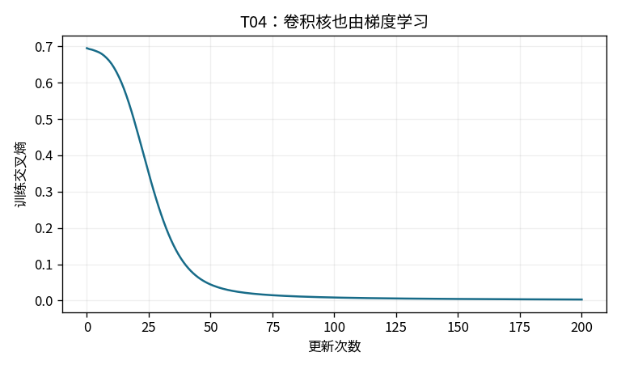
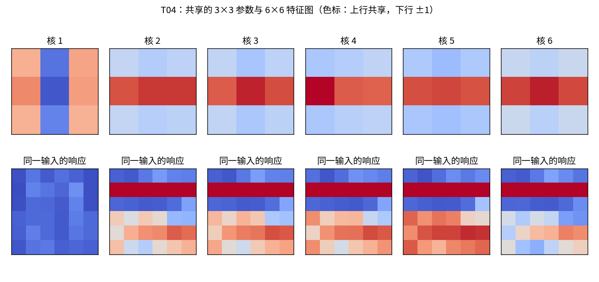
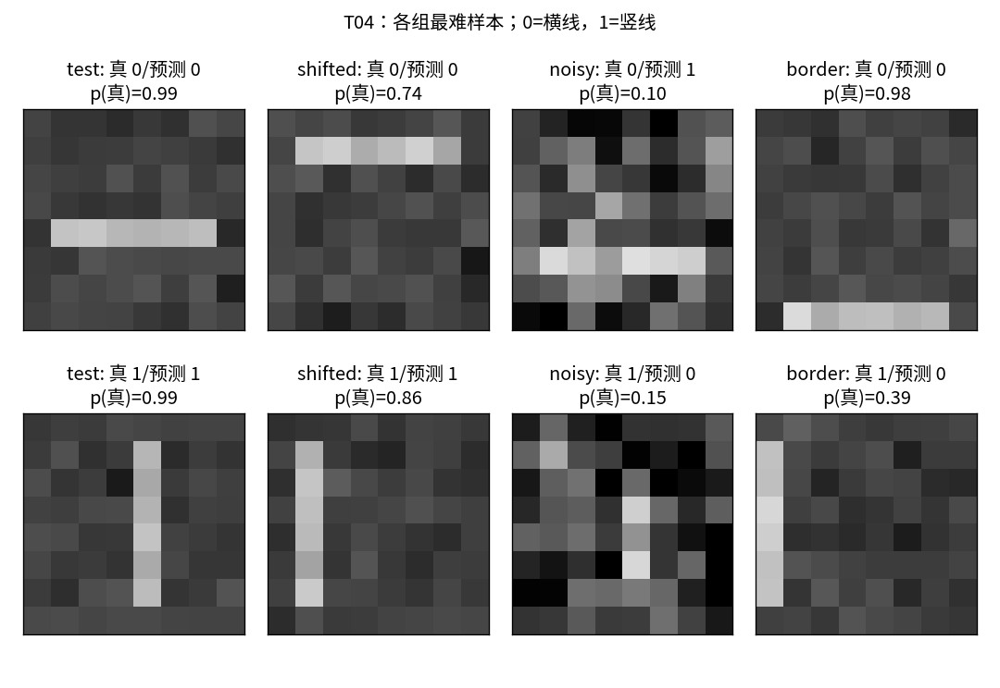

# T04：一个能完整拆开的 tinyCNN

## 从像素到方向判断

这个实验只判断 8×8 灰度图里的六像素线段是横向还是纵向。输入太小、类别太少，适合把每一步算清楚；它不是自然图像识别能力的缩影。实现只用 NumPy、Matplotlib 和标准库，训练与反向传播均为 float64，没有卷积库、自动求导或预训练参数。

网络只有一条路径：

- 输入 `[N,8,8]`
- 6 个可学习的 3×3 核，步幅 1、无填充，得到 `[N,6,6,6]`
- 每个通道加偏置并经过 tanh，形状不变
- 每张 6×6 特征图取全局平均，得到 `[N,6]`
- 线性分类头得到 `[N,2]`，用交叉熵训练；推理时以 softmax 得到两类概率

参数一共 `6×3×3 + 6 + 6×2 + 2 = 74` 个。卷积核的每个数都参与训练，分类头不会偷偷承担一个固定特征提取器之外的额外模型。

## 一次局部匹配怎样发生

代码中的运算严格说是**互相关**：核不翻转。把同一个 3×3 核移到每一个有效位置，逐元素相乘后求和。深度学习里通常也把这个操作叫卷积。

```text
竖线模板 K       竖线输入 V       横线输入 H
0 1 0           0 1 0           0 0 0
0 1 0           0 1 0           1 1 1
0 1 0           0 1 0           0 0 0
```

`sum(V*K)=1+1+1=3`，`sum(H*K)=1`。这是“某种局部结构响应更强”的最小例子；训练后的核并不被要求长得像这张竖线模板，也不必每个核都能单独解释。

`correlate2d` 保留了两个空间循环，遍历输出的行和列；每个位置内部用 NumPy 同时处理整个批次和全部滤波器。8×8 输入与 3×3 核的有效输出边长为 `8−3+1=6`。无填充意味着边缘参与局部窗口的次数少于中心，这是后面边界测试的重要原因。

## 梯度如何回到卷积核和像素

设某个位置的上游梯度为 `g[n,f,i,j]`，前向为：

`z[n,f,i,j] = Σu,v x[n,i+u,j+v] K[f,u,v] + b[f]`

核梯度把所有使用过这个共享参数的位置都加起来：

`dK[f,u,v] = Σn,i,j g[n,f,i,j] x[n,i+u,j+v]`

输入梯度则把每个窗口传回来的贡献累加到原像素：

`dx[n,i+u,j+v] += Σf g[n,f,i,j] K[f,u,v]`

这里的 `+=` 不能写成赋值。一个像素会出现在多个重叠窗口里。测试用 3×3 全 1 输入和 2×2 全 1 核验证了这种累加：上游全 1 时，输入梯度是 `[[1,2,1],[2,4,2],[1,2,1]]`。

分类头之后，平均池化把通道梯度均分给 36 个位置；tanh 再乘 `1−tanh(z)²`。损失是整批平均交叉熵，其 logits 梯度为 `(p−one_hot(y))/N`。这些缩放都显式写在代码中，核、偏置、分类头和输入共同接受中心差分检查。

## 数据和训练协议

训练集有 128 张图，横竖各 64 张；线段位置只取第 2、3、4、5 行或列（从 0 开始），叠加标准差 0.10 的独立高斯噪声。标签随机打乱，位置选择与标签独立。

四个评估集各有独立生成的 128 张图：

| 集合 | 与训练分布的关系 |
|---|---|
| test | 同分布，但随机数种子不同 |
| shifted | 线移到第 1 或 6 行/列，噪声仍为 0.10 |
| noisy | 保持训练位置，噪声标准差提高到 0.35 |
| border | 线位于第 0 或 7 行/列，噪声为 0.10 |

固定 seed=42，Adam 学习率 0.025，全批次更新 200 次。测试集只在评估时读取，不根据测试结果选模型或调整超参数。

## 本次实际运行

| 集合 | 交叉熵 | 准确率 |
|---|---:|---:|
| 训练前 | 0.694907 | 50.00% |
| 训练后 | 0.003029 | 100.00% |
| 独立 test | 0.003453 | 100.00% |
| shifted | 0.075233 | 100.00% |
| noisy | 0.119314 | 96.09%（123/128） |
| border | 0.166302 | 96.88%（124/128） |

有限差分抽查 60 个参数/输入分量，步长 1e−5，最大绝对误差为 `6.18e−12`；最大归一化相对误差为 `1.76e−6`，小梯度会放大这一相对指标。独立单元测试还检查了完整互相关的输入和核梯度、整网梯度，以及重叠累加。参数保存再读取后，独立测试集的 logits 最大绝对差为 0。





上图上行是训练得到的六个核，下行是同一张测试图的 tanh 特征图。核之间共用一个对称色标，特征图色标固定为 −1 到 1；颜色展示响应，不等于“重要程度”。



每个集合各展示一张横线和一张竖线，选择规则是该类真实标签概率最低，因而会优先暴露错误。图中 0 为横线，1 为竖线，`p(真)` 是模型给真实标签的概率。

## 这些结果支持什么

权重共享让同一套局部匹配规则用于多个位置；平均池化又减弱了对响应位置的依赖。本次向邻近位置平移后仍全部分类正确，但损失从 0.00345 升到 0.07523，说明置信程度已经下降。“准确率没变”并不等于输出没变。

这里没有严格的任意平移不变性。有效卷积的边界、有限图像尺寸和可见线段的变化都会改变平均响应。噪声组有 5 个错误，边界组有 4 个错误；它们正是简单结构在分布变化下的边界。128 张人工样本上的高分不支持对真实照片、旋转、尺度变化或复杂遮挡的承诺。

## 复现与定位代码

在项目根目录运行：

```bash
python -m toys.t04_cnn
python -m unittest discover -s tests -p 'test_t04_cnn.py' -v
```

也可指定 `--seed 42 --output-dir outputs/t04`。`outputs/t04/metrics.json` 保存完整测量与逐步损失；`parameters.npz` 保存训练后的四组参数。`load_model` 可直接恢复参数，`forward` 返回 logits 与反向缓存。改变种子会改变数据与初始化，不应把上表当成所有运行必然得到的分数。

主要入口位于 `toys/t04_cnn.py`：局部运算在 `correlate2d` / `correlate2d_backward`，整网在 `forward` / `backward`，实验协议在 `demo`。验证位于 `tests/test_t04_cnn.py`，共 7 项测试。
