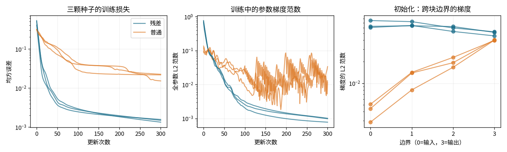
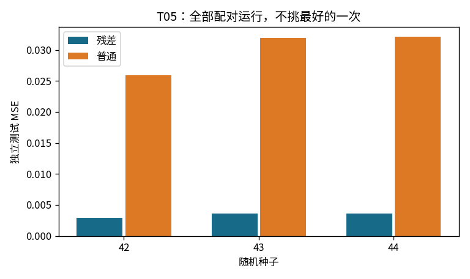

# T05：把“原样通过”加入一条可训练路径

## 先把残差连接缩成一行

普通模块给出 `y=F(x)`，残差模块给出 `y=x+F(x)`。差别是一次不带参数的相加，但它改变了模型表示函数和梯度传播的方式。

先取最小例子：`x=2`，`F(x)=a*x`，`a=0.5`。前向得到 `y=2+0.5×2=3`；对输入求导得到 `dy/dx=1+a=1.5`。若上游损失梯度为 `dy=1`，普通路径只传回 0.5，残差路径还会加上直接通过的 1。

这不是“梯度永远不会消失”的保证。若 `a=−1`，两条路径恰好抵消；高维情况下也可能出现放大、抵消或训练不稳定。残差连接提供的是额外的恒等路径，不是一个普遍的性能定理。

## 本实验的两种网络

输入和输出都是宽度 8 的向量。网络串联 3 个模块，每个模块的可训练分支为：

`u = tanh(h W1 + b1)`

`F(h) = u W2 + b2`

残差版输出 `h+F(h)`，普通版只输出 `F(h)`。所有矩阵都是 8×8；没有降维、投影捷径、卷积、归一化、额外分类头或最后激活。每个模块有 `64+8+64+8=144` 个参数，总数都是 `3×144=432`。

同一颗种子下，两种网络使用逐元素相同的初始分支参数。矩阵从标准差 `0.7/√8` 的正态分布初始化，偏置为 0。相同参数不意味着相同初始函数：一次跳连就会改变后续模块接收到的输入。

## 把反向传播写完整

设某模块输出收到上游梯度 `g`。分支的反向为：

- `dW2 = u.T @ g`，`db2 = sum_batch(g)`
- `dz = (g @ W2.T) * (1−u²)`
- `dW1 = h.T @ dz`，`db1 = sum_batch(dz)`
- 普通模块：`dh = dz @ W1.T`
- 残差模块：`dh = dz @ W1.T + g`

最后那项 `+g` 就是恒等路径。反向遍历三个模块时，每个模块都重新使用这一规则，不能只在整个网络的入口补一次梯度。

还有一个可直接验证的极限情况：把每个模块的 W2、b2 置零，分支便处处为零。残差网络前向精确返回输入，反向精确返回任意给定的上游梯度；普通网络此时输出零。测试同时验证了前向和反向恒等性，而不只看损失有没有下降。

## 受控但有限的比较

固定生成一组 96 个训练样本和独立的 128 个测试样本，输入每一维从 `[−1.5,1.5]` 均匀采样。目标函数为：

`target(x) = 0.6*x + 0.4*tanh(x @ A)`

A 是固定的随机 8×8 矩阵。这个目标特意含有类似恒等映射的成分，方便观察“在原输入上学习修正”的机制，因此它也偏向残差结构；不能把它包装成对所有任务的中立排名。

全部运行共享同一组数据，仅以种子 42、43、44 改变模型初始化。每一对模型使用相同的 Adam、学习率 0.01、全批次更新 300 次。损失是所有样本、所有输出维度上的平均平方误差：`mean((prediction−target)²)`，输出梯度为 `2*(prediction−target)/(N*8)`。没有挑最好的种子，也没有按测试集分数挑训练步数。

## 三次配对运行的实际结果

| 种子 | 残差训练 MSE | 普通训练 MSE | 残差测试 MSE | 普通测试 MSE |
|---|---:|---:|---:|---:|
| 42 | 0.001577 | 0.015200 | 0.002956 | 0.025872 |
| 43 | 0.001497 | 0.022487 | 0.003647 | 0.031970 |
| 44 | 0.001344 | 0.021669 | 0.003663 | 0.032096 |

三颗种子的测试均值与总体标准差分别为：残差 `0.003422 ± 0.000330`，普通 `0.029979 ± 0.002905`。这里的标准差只是三次初始化的描述性统计，不是置信区间。数据集、教师矩阵、宽度、优化器和训练预算都没有跨任务重复，不能据此作普遍优越性判断。

一个值得保留的细节：种子 42 的初始训练 MSE，残差为 0.407155，普通为 0.309622。残差版并不是一开始就更接近目标；它在这个设定与预算下优化得更好。



左图保留全部训练轨迹，中图记录所有参数梯度拼接后的 L2 范数，右图显示初始化时各块边界的损失梯度范数。右图横轴从输入边界 0 到输出边界 3，反向传播方向是从右向左。

以种子 42 为例，初始化时残差网络的边界梯度范数依次为 `[0.06046, 0.06439, 0.05311, 0.04605]`；普通网络为 `[0.002847, 0.008063, 0.01673, 0.04016]`。普通网络在向输入传播时明显衰减，而残差网络没有出现相同程度的衰减。

这些数是各自当前损失的梯度：两种模型的预测和输出误差本来就不同，因此不是把同一个输出梯度送入两张网络的严格 Jacobian 对照。机制依据是前面的链式法则和恒等性测试；曲线提供这次运行的补充观察。梯度大也不自动意味着更新更好，训练末期梯度变小还可能只是因为已接近局部最优。



## 数值验证

- 残差与普通两种路径都检查了输入及所有参数的中心差分，在宽度 3、两模块的小模型上各检查 57 个分量
- 步长为 1e−5，最大绝对误差：残差 `6.60e−11`，普通 `1.42e−11`
- 零分支恒等映射的前向最大误差为 0；单元测试还验证任意上游梯度能原样通过
- 六次训练分别保存并读取模型，独立测试集预测最大绝对差均为 0；保存文件同时记录是否启用残差路径
- 全部实现只使用 NumPy、Matplotlib 和标准库，数组为 float64，反向传播没有依赖自动求导

相等的参数量排除了一种明显的混杂因素，但没有让两个优化问题完全等价。这个三模块向量实验也没有复现大规模图像 ResNet 的瓶颈块、批归一化或深度效应；它隔离的是加法捷径这一机制。

## 复现与输出

在项目根目录运行：

```bash
python -m toys.t05_residual
python -m unittest discover -s tests -p 'test_t05_residual.py' -v
```

默认入口相当于 `--seed 42 --output-dir outputs/t05`。seed 决定三颗连续的初始化种子以及数据生成种子。`metrics.json` 保留每一步损失、参数/输入梯度范数、起止边界梯度和六个测试结果，便于复核，而非只留下均值。

`parameters_seed42_residual.npz` 等文件分别保存六次训练；`parameters.npz` 和 `parameters_plain.npz` 是第一颗种子的两种模型。`load_model` 返回参数及模式，之后可交给 `forward`。核心实现位于 `toys/t05_residual.py`，6 项自动测试位于 `tests/test_t05_residual.py`。
