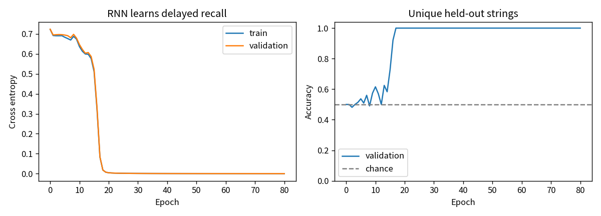
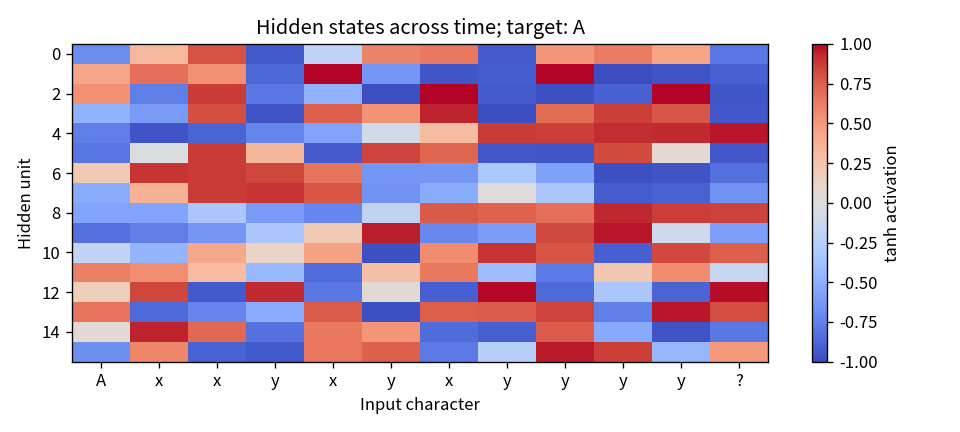
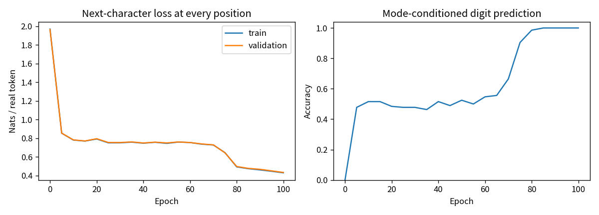

# T06：亲手展开 tanh RNN 与 BPTT

这个实验只用 Python、NumPy、Matplotlib 和标准库，在 CPU 上以 float64 训练。没有深度学习框架，也没有自动微分。代码：`toys/t06_rnn.py`；测试：`tests/test_t06_rnn.py`。

## 1. 一个真正需要记忆的任务

输入是完整的字符上下文，例如 `Axyxyxy?`；读到末尾 `?` 时，回答开头是 `A` 还是 `B`。中间的 `x/y` 是随机干扰，长度可变。输入词表是 `A B x y ?`，输出是两个类别 `A/B`。本节是延迟字符回忆，只在末尾给答案；第 7 节另加真正逐位置预测下一字符的合成语言模型。两者都不是通用语言模型。

每条上下文长度为 8–16：首字符 1 个，干扰字符 6–14 个，问号 1 个。每个长度生成 96 条，A/B 各半；先对完整字符串去重，再按长度、答案分层划分。共 864 个不同字符串：训练 648 条，验证 216 条，跨集合重复完整字符串为 0。短子串共享是有意的，因为我们要检验同一规则能否适用于没见过的完整上下文。`split_sequences.json` 保存实际划分，便于检查。

## 2. 前向：把过去压进一个向量

用行向量记号：

- `z_t = Wxh[x_t] + h_(t-1) @ Whh + bh`
- `h_t = tanh(z_t)`，每条序列的 `h_0 = 0`
- `logits = h_T @ Why + by`
- `p = softmax(logits)`；批次损失是正确答案负对数概率的平均值

`Wxh[x_t]` 等价于 one-hot 输入乘权重，只是没有真的建立 one-hot 矩阵。五组参数的形状分别是 `Wxh: 5×16`、`Whh: 16×16`、`bh: 16`、`Why: 16×2`、`by: 2`，共 386 个数。关键在于所有时间步共享同一个 `Whh`，参数量不会随输入长度增加。

先手算一维版本：`h_t = tanh(x_t + 0.5 h_(t-1))`，输入依次为 `1, 0`。

1. `h_1 = tanh(1 + 0.5×0) = 0.761594 ≈ 0.762`
2. `h_2 = tanh(0 + 0.5×0.761594) = 0.363399 ≈ 0.363`

第二步输入虽然为 0，状态仍非 0，说明第一步的信息留下了痕迹。

变长批次需要补齐。这里补齐位置执行 `h_t = h_(t-1)`，不会把填充值当作真实字符。每次 `forward` 默认从全零状态重新开始，调用前后没有暗中保留状态。

## 3. 反向：梯度沿时间倒着走

设批次大小为 B，`dlogits = (p - one_hot(answer))/B`，则：

- `dWhy = h_T.T @ dlogits`；`dby = sum(dlogits)`
- 从 `dh_T = dlogits @ Why.T` 开始，按 `T, T-1, …, 1` 遍历
- 真正的时间步：`dz_t = dh_t * (1 - h_t²)`
- 累加 `dWhh += h_(t-1).T @ dz_t`、`dbh += sum(dz_t)`
- 把 `dz_t` 累加到对应输入字符的 `dWxh` 行，用 `np.add.at` 处理重复字符
- 继续传播 `dh_(t-1) = dz_t @ Whh.T`

同一组参数被用过多次，因此必须把各个时间步的梯度相加。补齐步没有参数贡献，但状态复制的导数为 1，必须让梯度原样通过；不能简单把整条梯度清零。

再手算上面的一维例子。仅为解释链式法则，临时取 `L = h_2²/2`，这不是实际训练的交叉熵：

- `dL/dz_2 = h_2(1-h_2²) = 0.315409`
- `dL/dz_1 = 0.315409×0.5×(1-h_1²) = 0.066232`
- 对共享循环权重 `w=0.5`，第二步贡献 `0.315409×h_1 = 0.240214`，第一步贡献乘的是 `h_0=0`，所以总梯度为 `0.240214`

多次乘循环矩阵和 tanh 导数可能使梯度变大或变小。本实验做全局 L2 梯度裁剪：若所有参数梯度拼起来的范数超过 1，就统一乘 `1/norm`，保持方向，再交给手写 Adam。裁剪能限制过大的梯度，不能解决梯度消失。

## 4. 运行与检查

在项目根目录运行：

```bash
python -m unittest discover -s tests -p 'test_t06_rnn.py' -v
OPENBLAS_NUM_THREADS=1 python -m toys.t06_rnn --seed 42 --output-dir outputs/t06
```

默认训练 80 轮，批次大小 48，Adam 学习率 0.007，隐藏维度 16。固定最终轮的参数作为结果；验证集只用于记录曲线，不参与梯度更新，也不用于早停或挑选最优轮。

原有 9 项测试覆盖：手算递推；五组参数全部数值梯度；状态重置与种子复现；补齐与逐条计算的前向/反向等价性；完整序列无泄漏且标签平衡；全局裁剪；float64；小样本可训练性；输入校验。梯度检查用 3 维隐藏层和两个短序列，其中一条有补齐，中心差分步长为 `1e-5`，检查五组参数的全部 35 个元素。

## 5. 已实测结果

以下来自本次固定种子 42 的实际运行，不是目标值：

| 指标 | 结果 |
|---|---:|
| 初始验证交叉熵 / 正确率 | 0.723775 / 50.00% |
| 最终训练交叉熵 / 正确率 | 0.000131654 / 100.00% |
| 最终验证交叉熵 / 正确率 | 0.000132916 / 100.00% |
| 各长度 8–16 的验证正确率 | 均为 100.00% |
| 更新次数 / 实际裁剪次数 | 1,120 / 9 |
| 裁剪前最大梯度范数 | 2.012052 |
| 全部参数数值梯度最大绝对误差 | 9.22×10⁻¹² |
| 全部参数数值梯度最大相对误差 | 1.91×10⁻⁷ |

进一步做两种诊断：把验证上下文的开头 `A/B` 对调，同时改变正确答案，正确率仍为 100%；把开头全部抹成 `x`，保留原标签，正确率降到 50.93%。结果支持网络确实利用了开头字符，而不是只看末尾干扰字符。对调后的字符串可能与原训练数据重合，因此这项仅为诊断，不是独立测试集成绩。抹掉字符是分布外干预，也不能当成一般性的因果证明。

示例：`Axxyxyxyyyy? → A`，`Byxyxxxyyx? → B`，`Ayyyyxxyyyxxyxx? → A`。





产物：`metrics.json` 包含逐轮指标、各长度结果和逐参数梯度检查；`parameters.npz` 保存五组权重；`split_sequences.json` 保存划分；两张 PNG 展示学习曲线和隐藏状态。图中的单个隐藏维度不一定有独立的可解释语义。

加载已训练权重：

```python
import numpy as np
from toys.t06_rnn import TanhRNN, encode, LABELS
model = TanhRNN()
with np.load('outputs/t06/parameters.npz') as saved:
    for name in model.params:
        model.params[name][:] = saved[name]
x, lengths, _ = encode(['Axyxyxy?'])
print(LABELS[int(model.predict(x, lengths)[0])])  # A
```

## 6. 延迟回忆实验的边界

100% 只描述这个平衡、低熵的合成任务和这次验证划分，不意味着掌握自然语言。这里仅考察 8–16 个字符的延迟、单个符号的记忆；没有宣称更长上下文也有效。验证曲线不构成多个独立重复实验，也没有独立测试集或置信区间。可自行增加干扰长度、更换随机种子，或把开头信息换成多个待回忆字符，观察普通 tanh RNN 在更困难任务上的梯度与记忆限制。


## 7. 再把同一套递推接成逐位置字符语言模型

前面的回忆任务只能说明状态能携带信息，不等于下一字符预测。因此第二个演示保留相同 tanh 递推，为每个时间步都接上词表输出头：

`logits_t = h_t @ Why + by`

这里单独训练一套权重。词表为 `A B x y 0 1 >`，`>` 表示结束。合成语法由开头控制：

- 模式 A：每个随机 `x` 后接 `0`，每个随机 `y` 后接 `1`
- 模式 B：每个随机 `x` 后接 `1`，每个随机 `y` 后接 `0`
- 一条序列包含 3–7 对，因此完整长度为 8、10、12、14、16

例如 `Ax0y1x0>`、`By0x1y0>`。模型看到 `x/y` 后要结合上下文中的模式决定数字，单看当前 `x/y` 不足以决定答案。模式也可从之前的 x/y 与数字配对恢复，因此这项数字准确率本身不能证明始终记住了开头 A/B；前面的独立延迟回忆任务才直接检验较长间隔记忆。

枚举所有 496 条唯一完整字符串，按模式与长度分层，固定种子先划分为训练 372、验证 124，交集为 0。之后才把每条字符串切成 `inputs=s[:-1]`、`targets=s[1:]`，原始划分保存在 `language_split_sequences.json`。

举例：完整 `Ax0>` 变成输入 `[A,x,0]`、目标 `[x,0,>]`。它不是把原字符当自己的标签，也不是只给最后一个时间步监督。

### 每个位置都有损失时，BPTT 有什么不同

实际损失为所有非补齐位置的交叉熵平均：`L=sum(valid CE)/真实目标字符总数`，不是对变长序列各算一个平均后再等权平均。

倒序遍历时，当前状态会同时收到本步输出头与未来状态的梯度：

1. `dWhy += h_t.T @ dlogits_t`，`dby += sum(dlogits_t)`
2. `dh_t = 本步 dlogits_t @ Why.T + 从未来传回的梯度`
3. `dz_t = dh_t * (1-h_t²)`，并屏蔽补齐位置的参数贡献
4. 累加输入、循环矩阵、偏置梯度，再把 `dh_(t-1)` 传回

补齐目标完全不计损失。补齐隐藏状态仍是复制，反向保持恒等路径。5 项新增测试保留前述全部测试，并增加：五组参数全部 61 个标量的下一字符损失差分；补齐批次与按真实 token 数加权的逐条损失/梯度相等；完整序列拆分；小样本学习与生成；两个输出模式的保存/加载完全等价。**T6 合计 14 项测试**。

### 本次真实训练与生成

默认隐藏维度 16，Adam 学习率 0.007，batch 32，训练 100 轮，梯度范数裁剪为 1；固定最后一轮，不按验证分数选 checkpoint。上述同一 CLI 会依次完成两个演示。

| 下一字符模型指标 | 实测结果 |
|---|---:|
| 训练 / 验证 CE（每个真实 token） | 0.428735 / 0.432498 |
| 训练 / 验证所有下一字符准确率 | 74.07% / 70.76% |
| 验证条件数字准确率 | 100.00% |
| 全部 61 标量数值梯度最大绝对误差 | 1.33×10⁻¹¹ |
| 保存重载 logits | 逐位相同 |

x/y 本身是随机选择，结束长度也有变化，所以整体 token 准确率低于条件数字准确率是预期现象。条件数字准确率只统计目标是 `0/1` 的位置，不能冒充全序列准确率。



贪心续写逐次把自己的预测接回输入，无采样、无语法修正。以下是不同续写预算的原始结果：

| 提示 | 最多新字符 | 实际输出 | 是否生成结束符 |
|---|---:|---|---|
| `A` | 7 | `Ay1y1y1x` | 否，预算耗尽 |
| `A` | 11 | `Ay1y1y1x0x0x` | 否，预算耗尽 |
| `A` | 15 | `Ay1y1y1x0x0x0x0>` | 是 |
| `B` | 15 | `By0y0y0y0x1y0>` | 是 |
| `Ax0y1x` | 11 | `Ax0y1x0x0x0x0x0>` | 是 |
| `By0x1y` | 11 | `By0x1y0y0x1y0>` | 是 |

这些结果中已完成的字符对符合各自模式；短预算结果仍有未完成的字符对，不能算完整合法序列。自由生成是展示条件语法，并非要求重现某条随机验证后缀。`metrics.json` 的 `next_character_model` 保存所有 12 个生成例、结束标记、曲线及检查。重复选择 x/y、偏好某些长度或更长预算下循环，都是这个小型贪心模型可能的失败方式；没有测量就不宣称解决了它们。

加载第二套权重生成：

```python
from toys.t06_rnn import TanhRNN, generate_language
model = TanhRNN.load('outputs/t06/language_parameters.npz')
print(generate_language(model, 'A', max_new_tokens=15))
```

原来的 `parameters.npz` 仍对应延迟回忆，新的 `language_parameters.npz` 对应逐位置字符模型，避免混用输出头。两个任务都显式测试和记录了重载 logits 等价。
