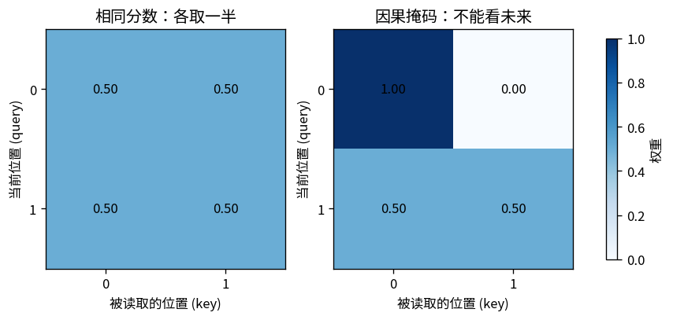

# T07：把自注意力拆成可手算、可求导的四步

只用 NumPy、Matplotlib 和标准库，CPU、float64。没有框架、自动微分或预训练权重。这个玩具验证的是一个算子，不把随机权重的输出包装成训练成绩。

- 实现：`toys/t07_attention.py`
- 测试：`tests/test_t07_attention.py`
- 输出：`outputs/t07/`

## 1. 为什么要让位置之间互相读取

RNN 把过去压进一个逐步更新的隐藏状态。注意力允许当前位置给可见的历史位置分配不同权重，再读取它们的值。本实现只有一个注意力头；多头不是理解这个基本运算的前提。

输入 `X` 为 `B×T×D`，四个可训练矩阵均为 `D×D`：

1. 投影：`Q=XWq, K=XWk, V=XWv`
2. 打分：`S=QKᵀ/√D`
3. 按 key 方向归一化：`A=softmax(S+mask)`
4. 读取并投影：`H=AV, Y=HWo`

Q 是“当前位置拿什么来问”，K 是“各位置拿什么被匹配”，V 是“真正取回的数值”。这些是理解运算的比喻；参数并不天然具有可读的语言含义。`√D` 缩放可以控制在分量尺度类似时点积随维度增大的现象，不保证所有情况下分数都小。

## 2. 一个完整手算例子

令两个位置的 query、key 都为零，所以任一 query 对两个 key 的分数均为 `[0,0]`；值分别为 `2` 和 `6`。

- `softmax([0,0])=[0.5,0.5]`
- 输出为 `0.5×2+0.5×6=4`
- 加因果掩码后，第一个位置只能看自己，权重成为 `[1,0]`，输出 `2`
- 第二个位置仍可看两个位置，输出 `4`



因果掩码采用 `True=允许` 的布尔约定，允许 key 下标不大于 query 下标。代码先把禁止位置设为负无穷，再减去该行最大值计算 softmax，因而禁止位置的指数严格为零。若一整行都被屏蔽，最大值也是负无穷，会出现未定义运算；本实现提前抛出 `ValueError`，不把它变成一行假概率。

## 3. 反向传播，逐块写出来

给定输出梯度 `G=dL/dY`，矩阵乘法先给出：

- `dWo=HᵀG`，批次和时间维折叠后累加
- `dH=GWoᵀ`
- `dV=AᵀdH`
- `dA=dHVᵀ`

最关键的 softmax 反向不是逐元素相乘。对某一行 `a` 与它收到的梯度 `g`：

`dS = a * (g - sum(g*a))`

例如 `a=[0.5,0.5]`、`g=[2,6]`，则加权和为 `4`，得到 `dS=[-1,1]`。第一项的分数上升会挤掉第二项的权重，所以两个导数互相耦合，且该行梯度和为零。

继续沿缩放点积反传：

- `dQ=dS K /√D`
- `dK=dSᵀ Q /√D`
- `dWq=XᵀdQ`，K、V 投影同理
- `dX=dQWqᵀ+dKWkᵀ+dVWvᵀ`

三条分支都使用了同一个 X，因此必须相加。被屏蔽分数的梯度设为零。完整实现可以在 Transformer 里复用，而不只是画一张权重图。

## 4. 运行与 API

在项目根目录运行：

```bash
python -m unittest discover -s tests -p 'test_t07_attention.py' -v
OPENBLAS_NUM_THREADS=1 python -m toys.t07_attention --seed 42 --output-dir outputs/t07
```

复用投影后的自注意力：

```python
import numpy as np
from toys.t07_attention import init_attention, attention_forward, attention_backward
rng = np.random.default_rng(42)
x = rng.normal(size=(2, 4, 3))
params = init_attention(3, rng)
y, cache = attention_forward(x, params, causal=True)
dx, grads = attention_backward(np.ones_like(y), cache, params)
print(y.shape, dx.shape)  # (2,4,3), (2,4,3)
```

底层 `scaled_dot_product(q,k,v,mask=None)` 还允许 query 与 key 长度不同、value 宽度与 Q/K 宽度不同。`scaled_dot_product_backward` 返回 `dQ,dK,dV`。本玩具不提供 dropout、padding 自动识别、KV cache 或多头封装。

## 5. 实测检查与局限

固定 seed 42 的实际 `metrics.json`：

| 检查 | 实测 |
|---|---:|
| 相同分数权重 | `[0.5,0.5]` |
| 普通 / 第一个因果输出 | `4 / 2` |
| 投影参数与输入的中心差分最大绝对误差 | `1.52×10⁻¹¹` |
| 差分最大相对误差 | `1.72×10⁻¹⁰` |
| demo 抽查标量数 | 56 |
| 未来位置扰动对较早输出的最大改变 | `0` |
| 权重行和与 1 的最大差异 | `2.22×10⁻¹⁶` |
| 禁止位置的最大权重绝对值 | `0` |

6 项测试额外覆盖所有小张量 Q/K/V、所有投影参数与输入的数值梯度、禁止全屏蔽行、巨大但有限分数的数值稳定性。中心差分步长 `1e-5`；这些检查支持实现正确，但不能证明任意输入下都无错误。

`parameters.npz` 保存 demo 的随机投影矩阵，**它们没有经过训练**。注意力权重显示“模型此时如何加权读取”，不能直接当作自然语言解释或因果重要性。完整语言模型还需要位置、残差、归一化、非线性网络、输出目标及训练；下一篇把这些部件接起来。
