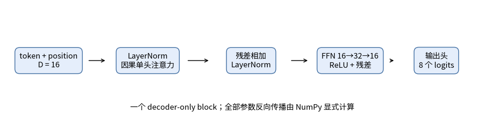
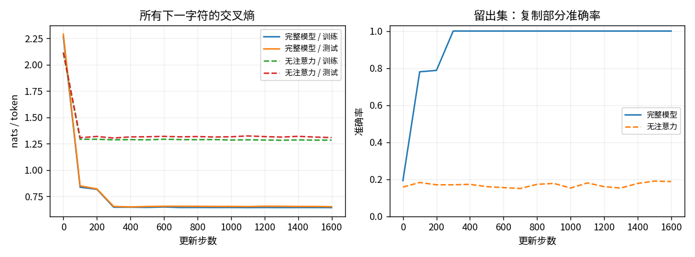
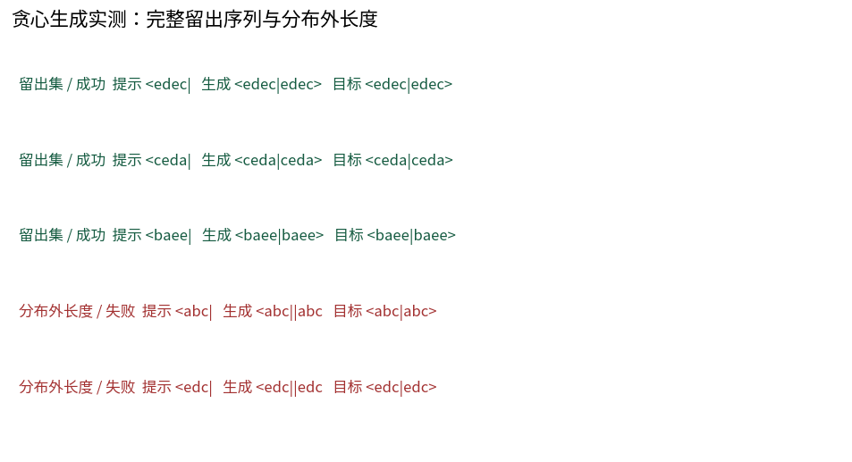

# T08：从嵌入到生成，手写一个完整的小 Transformer

这里训练一个只有 **2,648 个参数** 的 decoder-only Transformer。所有前向和反向都由 NumPy 显式实现，包括 LayerNorm、残差、注意力、FFN、位置与 token 嵌入；不使用自动微分、深度学习框架或预训练模型。CPU、float64。

代码：`toys/t08_transformer.py`；注意力复用 T07；测试：`tests/test_t08_transformer.py`。

## 1. 用复制任务把“使用上下文”变成可测量的事

词表是 8 个字符：`< a b c d e | >`。一条完整序列例如：

`<abce|abce>`

模型读到提示 `<abce|` 后，要逐个生成 `abce>`。训练采用标准的下一字符预测：输入是完整字符串除最后一位，标签是完整字符串除第一位。每个位置都计算交叉熵，包括提示部分。

`a` 到 `e` 的四字符组合有 `5⁴=625` 种。先生成所有唯一完整字符串，固定种子打乱，再选 400 条训练、100 条测试，剩余 125 条不参与。本次训练/测试完整字符串交集为 **0**；先划分完整字符串，再切输入和标签，避免把同一序列的前后片段拆进两个集合。共享短子串是此任务希望复用的规则，不等于完整序列泄漏。

注意：任务长度固定，整条 11 字符、训练输入 10 字符。这不是自然语言数据。每条提示的随机四字母本来无法提前预测，不能要求所有位置的交叉熵都趋近零。

## 2. 一个 block 到底做了什么

默认维度 `D=16`，FFN 中间维度 `32`，一个单头因果注意力 block，学习式位置嵌入，预归一化（Pre-LN）：

1. `X = TokenEmbedding[ids] + PositionEmbedding[position]`
2. `N1 = LayerNorm(X)`
3. `U = X + CausalAttention(N1)`
4. `N2 = LayerNorm(U)`
5. `H = U + ReLU(N2 W1 + b1) W2 + b2`
6. `logits = H Wout + bout`



16 组可训练张量：token、position 两张表；两个 LayerNorm 各自的 gain/bias；注意力的 Wq/Wk/Wv/Wo；FFN 的两个权重与两个偏置；输出头的权重与偏置。位置表预留 14 个位置，未在训练里使用的位置行没有梯度，也不能因为有表格行就声称具有长度外推能力。

这里没有多头、多层、dropout、KV cache、权重绑定或最后一个额外的 LayerNorm。这些是明确的简化；它仍是一条包含可训练嵌入、因果注意力、残差、归一化、FFN 与自回归输出的完整计算图。

## 3. 用很小的数字理解关键部件

### 残差不是“跳过学习”

若某个位置输入 `x=[1,2]`，子层输出 `f(x)=[0.2,-0.3]`，相加得到 `[1.2,1.7]`。反向时，若上游给 `g`，则输入一条路径直接收到 `g`，另一条路径收到子层反传的梯度；代码必须把两者加起来。

### LayerNorm 按当前位置的特征归一化

对 `x=[1,3]`，均值 2、方差 1；若暂忽略极小的 epsilon，归一化为 `[-1,1]`。gain 为 `[2,0.5]`、bias 为 `[0,1]` 时，结果为 `[-2,1.5]`。代码实际用 `epsilon=1e-5`，所以数值会有约十万分之一级的差异。

每个 token 独立计算特征维的均值和方差，不混入别的位置。因此 LayerNorm 不会偷偷读取未来。令 `n=(x-mean)/std`、`u=upstream*gain`、特征维大小 D，则：

- `dgain = sum(upstream*n)`，在 batch 与时间维求和
- `dbias = sum(upstream)`
- `dx = (u-mean(u)-n*mean(u*n))/std`

### Embedding 的梯度要累加

序列里同一个字符可以出现多次。它们查的是同一行 embedding，反向必须把每次贡献加到那一行。实现用 `np.add.at`；带重复索引的普通 `table[ids] += grad` 可能漏加，这不是可忽略的小细节。

### 因果掩码和目标右移缺一不可

输入 `<abc`、标签 `abc|` 时，当前位置的目标是下一个字符。注意力只允许读取自己及更早位置。如果忘了掩码，训练时模型可能直接看到目标所在位置，得到漂亮但无效的损失。测试显式改变未来 token，要求所有更早 logits 逐位完全不变。

## 4. 训练、生成与数值验证

```bash
python -m unittest discover -s tests -p 'test_t08_transformer.py' -v
OPENBLAS_NUM_THREADS=1 python -m toys.t08_transformer --seed 42 --output-dir outputs/t08
```

默认 Adam 学习率 0.003，batch 32，1,600 次更新，全局梯度范数裁剪到 1。训练 batch 从训练集有放回抽样。每 100 步记录训练/测试指标；使用固定最后一步参数，没有按测试曲线挑选 checkpoint 或早停。

训练时每个位置拿到的先前字符是真实字符（teacher forcing）。生成时只给提示，每次取最后一个位置 logits 的 argmax，把选出的字符接回输入，直到 `>` 或预算耗尽。因此另外报告完整自由生成正确率，不能用 teacher-forced token 准确率代替它。

8 项测试包含：

- 独立 LayerNorm 对输入、gain、bias 的数值梯度
- 缩小到 D4/FF6 的完整模型，对全部 16 组参数的**每个标量**做中心差分；包含两个嵌入表、两个 LayerNorm、四个注意力投影等
- 输出形状、float64、损失与梯度有限
- 未来 token 扰动不影响前缀 logits
- 保存/重载参数后 logits 逐位相同，完整与无注意力模式都检查
- 完整序列唯一且 train/test 不重叠
- 无注意力模型不能从其他位置读取信息
- 越界 token、非整数 token 与过长输入的错误检查

数值差分步长 `1e-5`。ReLU 在零点不可导；检查使用固定随机初始化，并没有通过选取训练后参数掩盖梯度错误。

## 5. 已实测结果，而不是预设目标

固定 seed 42 的本次运行：

| 指标 | 完整模型 | 无注意力消融 |
|---|---:|---:|
| 测试所有下一字符 CE（nats/token） | 0.651322 | 1.307988 |
| 测试所有下一字符准确率 | 66.70% | 34.10% |
| 测试四个复制字符准确率 | 100.00% | 18.75% |
| 100 个留出提示的完整贪心生成正确率 | 100.00% | 0.00% |

完整模型训练 CE 为 0.642601。为何全部 token 准确率只有 66.7%，复制却全对？10 个预测位置中，4 个是随机提示字母，4 个是可复制字母，2 个是结构字符。理想独立均匀提示的期望不可约损失为 `4×ln(5)/10≈0.644`，所有 token 准确率的参考值约为 `(4×0.2+6)/10=68%`。有限划分、样本相关与拟合误差会让实测值上下偏离，0.644 不是这个有限数据集的严格经验下界。

消融保留相同随机初始化、训练数据、batch 种子、优化器和更新次数，只把注意力输出替换为零。未使用的注意力参数仍保存在参数字典中，但梯度为零。此时每个位置只能处理本位置的字符与位置编码，无法读取完整提示；消融改变了功能与有效参数数量，不能把分数差机械归因为某一个单独机制。



因果性检查前缀 logits 最大变化 `0`；保存重载 logits 逐位相同。逐参数中心差分误差详见 `metrics.json`，最大绝对误差在 `10⁻¹⁰` 量级。这里是单个种子、单个划分，没有置信区间，也没有声称泛化到任意复制算法。

## 6. 成功样例与真实失败

留出集中实测：

- `<edec|` → `<edec|edec>`，正确
- `<ceda|` → `<ceda|ceda>`，正确
- `<baee|` → `<baee|baee>`，正确

本次 100 条标准长度留出样例都成功，没有虚构同分布失败。把长度改成训练没见过的 3 或 5 字母，则真实失败：

- 提示 `<abc|`，目标 `<abc|abc>`，生成 `<abc||abc`
- 提示 `<abcde|`，目标 `<abcde|abcde>`，生成 `<abcde|bcd>`

这是**分布外长度探针**，不并入前述测试准确率。短样例还可能在预算内未生成结束字符；图和 JSON 保留原始生成，不偷偷修正。模型更像学会了固定位置之间的读取规则，没有因此学会任意长度的复制程序。



## 7. 保存的产物与继续实验

`outputs/t08/` 包含：

- `parameters.npz`、`parameters_no_attention.npz`：完整与消融权重、注意力开关
- `dataset.npz`：实际训练/测试 token 序列
- `metrics.json`：指标、逐参数梯度检查、因果性、重载与示例
- `history.json`：两种模型的完整记录曲线
- `generations.json`：全部 100 条留出提示与实际生成
- `structure.png`、`training_curves.png`、`generations.png`

直接加载生成，无需重新训练：

```python
from toys.t08_transformer import TinyTransformer, generate
model = TinyTransformer.load('outputs/t08/parameters.npz')
print(generate(model, '<edec|'))  # <edec|edec>
```

可继续改变训练长度分布、字母种类、位置编码或注意力头数，再保持相同的完整序列拆分、数值梯度与因果性检查。先保证实验能区分“固定模板的成功”和“规则的外推”，再考虑让模型变大。
