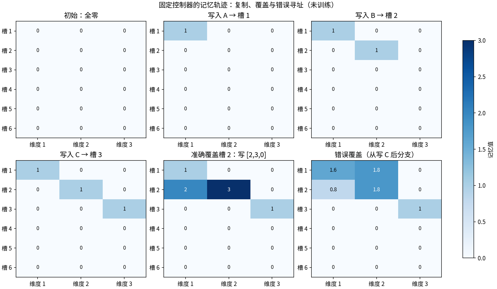
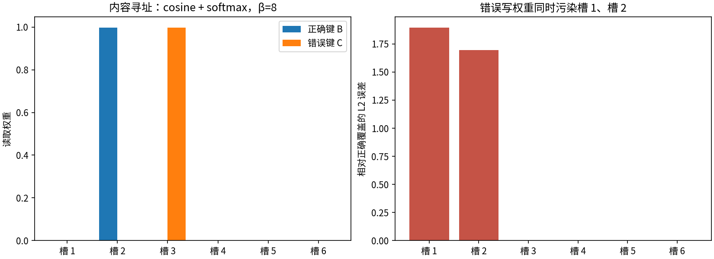

# T09：把记忆放在网络外面

一个系统可以把中间结果写进独立的矩阵，稍后再读取。这里真正需要区分的是三件事：**存了什么、读哪里、写哪里**。记忆矩阵保存内容；寻址权重决定访问位置；控制器产生这些权重以及要写入的向量。

本例用 6 个槽、每槽 3 个浮点数，将内容寻址、加权读取和擦除—添加写入拆成可以直接检查的函数。控制器是明确写死的操作序列，没有训练。原始 Neural Turing Machine 则把外部记忆与可训练控制器结合，研究从样例中学会复制等操作；本例只拆解其中的读写机制，不能视为那项训练结果的复现。[Graves、Wayne 与 Danihelka，2014](https://arxiv.org/abs/1410.5401)

## 三个可以手算的操作

令记忆为矩阵 M，槽 i 的内容为 Mᵢ，访问权重为 wᵢ。读取是加权求和：

```text
r = Σᵢ wᵢ Mᵢ
```

例如 M = [[1, 0], [0, 1]]，w = [0.25, 0.75]，则 r = [0.25, 0.75]。权重 [0, 1] 则精确读出第二行。这个输出是向量的混合，不一定等于某个完整的槽。

内容寻址先比较查询向量 k 与每行的余弦相似度，再归一化：

```text
sᵢ = cosine(Mᵢ, k)
wᵢ = exp(βsᵢ) / Σⱼ exp(βsⱼ)
```

β 控制分布的尖锐程度。较大 β 让最相似的槽更突出，但不能修复错误的查询。实现规定零向量参与计算时相似度为零，因此零查询或全零记忆给出均匀权重；这是一项明确的数值约定，而不是找到了有用内容。β = 0 同样得到均匀权重。

写入分为按坐标擦除和添加：

```text
M′ᵢ = Mᵢ ⊙ (1 − wᵢe) + wᵢa
```

e 的每个坐标在 [0, 1] 内，a 是添加向量。对上面的二行矩阵，取 w = [0, 1]、e = [1, 1]、a = [2, 3]，结果为 [[1, 0], [2, 3]]。第二行完全覆盖，第一行保持原样。若 w 全零，整个写入为空操作；若 e 和 a 都全零，也为空操作。只有擦除为零而添加不为零时，操作是在原内容上累加。

读取与写入 API 允许非负、总和不超过 1 的权重，以包含“不访问任何槽”的全零情况；内容寻址返回的权重总和为 1。零权重的槽不会因写入而改变，包括仍为空的槽。

## 一条成功轨迹和两个受控失败

固定控制器依次把 A = [1, 0, 0]、B = [0, 1, 0]、C = [0, 0, 1] 写到前三槽，再按同样顺序用 one-hot 权重读出。因为位置事先给定，这条复制轨迹的最大绝对误差为 **0**。它验证了读写实现，没有证明控制器学会了复制。

接下来，控制器用 one-hot 权重把第二槽覆盖为 [2, 3, 0]。另一个分支从“刚写完 C”的同一初态出发，错误地使用 [0.6, 0.4, 0, 0, 0, 0] 写入同一向量。此时第一槽变为 [1.6, 1.8, 0]，第二槽变为 [0.8, 1.8, 0]：错误权重同时污染两个槽。它不是正确覆盖之后的下一步。



另一项对照只改变读取键。在覆盖之前，目标是 B，β = 8：

| 检查量 | 实测值 |
|---|---:|
| 正确键给第二槽的权重 | 0.998325496 |
| 正确键读取相对 B 的 L2 误差 | 0.001740196 |
| 错误键 C 读取相对 B 的 L2 误差 | 1.412793055 |
| 错误写入相对正确写入的 Frobenius 误差 | 2.545584412 |
| 正确覆盖时未访问槽的最大变化 | 0 |
| 序列化再加载的最大误差 | 0 |

正确内容寻址仍有微小混合误差，因为有限 β 的 softmax 不是 one-hot；错误键则非常自信地读到了 C。**有记忆不等于能正确取用记忆。**



## 复现与检查

在项目根目录运行：

```bash
python -m toys.t09_memory --seed 42
python -m unittest discover -s tests -p 'test_t09_memory.py' -v
```

默认输出在 `outputs/t09/`：两张图、`metrics.json`、完整操作与矩阵快照 `trajectory.json`，以及可重新加载的 `memory.json`。`seed` 是系列统一接口的一部分；本模块的固定操作不使用随机数，因此改变它不会改变数值结果。

主要接口为 `content_address(M, key, beta)`、`weighted_read(M, w)`、`erase_add(M, w, erase, add)`。最后一个函数返回新矩阵，不修改输入；`ExternalMemory.write` 更新实例状态。`ExternalMemory.save/load` 使用带版本标记的 JSON 保存浮点矩阵。

12 项单元测试覆盖手算值、one-hot 读取、完全擦除、两种空操作、未访问零槽、零范数、零权重、大数有限性、非原地写入、错误输入与序列化。

## 能说明什么，不能说明什么

这个小系统说明外部状态如何被软权重访问，以及“地址错了”如何造成可量化的混合和污染。它没有可训练控制器、反向传播、位置寻址或长序列泛化实验，也没有文档检索、文本分块、向量数据库与生成器，所以不是完整 NTM 或 RAG。下一步若要研究“学会记忆”，必须让控制器从输入产生操作，并用训练外序列检验它，而不能把这里的精确复制当作学习能力。
