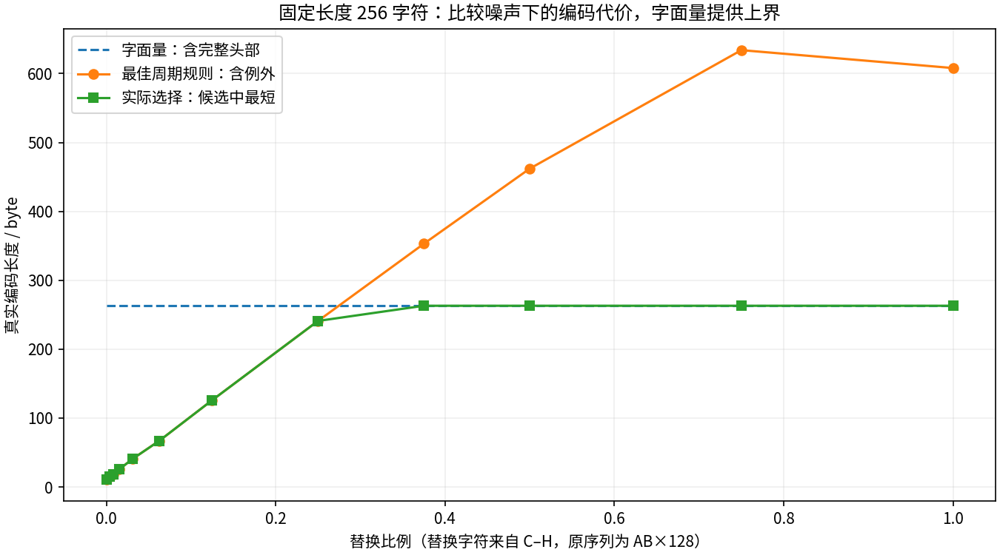
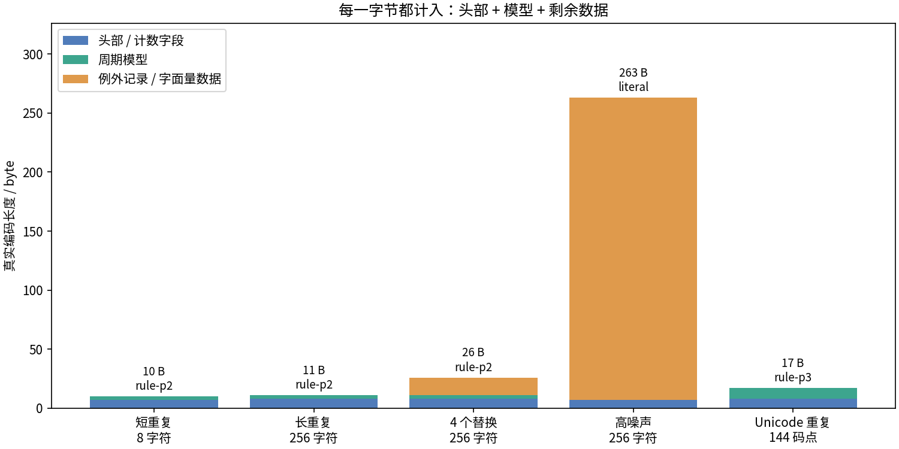

# T10：解释数据，也要给解释本身付费

如果一段数据重复很多次，写出规律通常比逐字抄写更短；一旦例外太多，记录规律和例外反而更贵。最小描述长度（MDL）的重要视角是比较完整描述的代价，而不是只奖励表面上简短的模型。本例把这个想法落实成一个真的可以解码的字节格式。[Grünwald，2004](https://arxiv.org/abs/math/0406077)

`encode(str) -> bytes` 返回完整编码，`decode(bytes) -> str` 恢复原字符串。编码器比较一个字面量候选和最多 16 个周期规则候选，取**这个有限候选集合中**字节数最少的一项。它不搜索所有程序或所有压缩模型，因而没有计算最优压缩率或 Kolmogorov 复杂度。

## 先用一个受限记法手算

暂时只考虑大写 ASCII 字符。规定 `L` 后面跟原文；`R` 后面是一个 1–9 的重复次数、恰好两个模式字符，还可以跟一个 1–9 的位置及一个替换字符。替换位置从 1 开始，并必须落在展开后的字符串内。这是为手算临时规定的受限语法：

| 原字符串 | 受限记法 | ASCII 字节数 |
|---|---|---:|
| ABABABAB | LABABABAB | 9 |
| ABABABAB | R4AB | 4 |
| ABABABAC | R4AB8C | 6 |

最后一行先生成四次 AB，再把第 8 个字符改成 C。6 字节中已经包括 `R`、次数、模式、位置与替换值。这个记法限制了次数、位置和模式长度；**下面的实际编解码器不使用该语法，也不把 4 字节或 6 字节冒充其真实输出长度。**

## 实际格式：每个字段都有边界

字节流以 4 字节 ASCII 标识 `MDL1` 开始，随后是单字节模式 `L` 或 `R`。所有整数使用规范的无符号 base-128 varint：低 7 位组先写，每个非末字节的最高位为 1；只接受最短表示，最大值为 2⁶³−1。例如 8 写成十六进制 `08`，256 写成 `80 02`。

```text
字面量：
  MDL1 | L | varint(UTF-8 字节数) | 原文的 UTF-8 字节

周期规则：
  MDL1 | R | varint(输出码点数 n)
       | varint(模式的 UTF-8 字节数) | 模式 UTF-8 字节
       | varint(例外数 k)
       | 例外记录 1 | ... | 例外记录 k

每条例外记录：
  varint(从 0 开始的绝对码点位置)
  | varint(替换字符的 UTF-8 字节数) | 一个替换码点的 UTF-8 字节
```

这里的竖线仅用于展示字段边界，不写入字节流。边界由 varint、自带长度的字段和已知数量的记录确定，因此标点、数字、换行、反斜杠以及 NUL 都不需要特殊分隔符转义。字符位置按 Python Unicode 码点计算，不是 UTF-8 字节位置，也不是人眼所见的字素簇。为连孤立代理码点这样的 Python 字符串也能往返，UTF-8 编解码一致使用 `surrogatepass`；普通 Unicode 标量仍是通常的 UTF-8。

规则展开为重复模式并截断到 n 个码点，再按严格递增、互不重复的例外位置替换。模式长度必须在 1 到 min(16, n) 之间。空串只使用字面量，完整编码为 6 字节。解码器拒绝未知版本、错误模式、截断、非规范整数、非法 UTF-8、越界或重复位置、多码点替换、冗余例外和尾随字节。

长度、版本、模式标签和所有记录都计入实际 `len(encoded)`。字面量的分解为“头部 + 原文数据”；规则的分解为“头部及计数 + 模型及其长度 + 例外记录”。因此图中的“例外记录 / 字面量数据”是剩余数据成本，字面量不会被错误地标成零成本模型。

## 候选规则如何产生

对 p = 1…min(16, n)，分别检查每个余数类：第 j、j+p、j+2p… 个位置。该组最常出现的字符成为模式的第 j 个字符，频数并列时按 Unicode 码点顺序取最小值。所有不匹配该模式的位置成为例外。

这样每个 p 只有一个确定的候选，并没有遍历该周期下的所有模式。频数最高也不保证包含变长 UTF-8、位置整数后的总代价最小；它只是产生候选的启发式。之后再精确计算每个候选的完整字节长度，与字面量一起比较。总长并列时优先字面量，再优先较小周期，因此相同输入总能得到相同输出。

无损性的原因也很直接：非例外位置由模式生成，所有不同的位置逐个保存原码点。解码恢复这两部分后，得到的每个位置都与输入一致。

## 真正运行后的数字

默认种子为 42。`AB` 重复 128 次的原文为 256 字节，字面量帧为 **263 字节**，周期规则为 **11 字节**：4 字节标识 + 1 字节模式 + 2 字节输出长度 + 1 字节模式字节数 + 2 字节 AB + 1 字节零例外数。

| 输入 | 原文 UTF-8 字节数 | 实际选中 | 完整编码字节数 |
|---|---:|---|---:|
| 空串 | 0 | literal | 6 |
| ABABABAB | 8 | rule-p2 | 10 |
| ABABABAC | 8 | rule-p2 | 13 |
| AB×128 | 256 | rule-p2 | 11 |
| AB×128，固定 4 个替换 | 256 | rule-p2 | 26 |
| 256 个高噪声字符 | 256 | literal | 263 |
| “春🌱换行”重复 48 次 | 384 | rule-p3 | 17 |

短字符串即使胜过“带同样格式开销的字面量候选”，也未必比裸 UTF-8 更短：8 字节的 ABABABAB 编码后是 10 字节。完整协议开销不能省略。

`ABABABAC` 的真实规则编码为：

```text
4d 44 4c 31 52 08 02 41 42 01 07 01 43
MDL1        R  n  长 AB    k  位 长 C
```

其中 `n=8`，`k=1`，从 0 开始的位置 `7` 要替换成 `C`，总计 13 字节。`outputs/t10/exact_examples.json` 保存每个例子的完整输入、编码十六进制、解码结果和所有候选的成本，可直接核对，而不仅是估算压缩率。

## 噪声实验：字面量是一条保险线

从固定的 256 字符交替序列出发，按固定随机次序替换 0、1、2、4、8、16、32、64、96、128、192、256 个位置。替换字符来自 C–H，每次都不同于原来的 A/B。实际选择的总字节数依次为：

```text
11, 15, 18, 26, 41, 67, 126, 241, 263, 263, 263, 263
```



规则候选不断重新估计模式，所以规则成本并不保证随替换比例严格单调增加；曲线是这条固定样本轨迹，不是统计定律。可以严格保证的是，最终输出不会长于**本格式的字面量候选**，因为后者始终参与比较。这个保证并不等于“不超过原文裸字节数”。



## 复现、接口与边界

在项目根目录运行：

```bash
python -m toys.t10_mdl --seed 42
python -m unittest discover -s tests -p 'test_t10_mdl.py' -v
```

默认输出为 `outputs/t10/metrics.json`、`exact_examples.json`、`noise_costs.json` 与两张图。`candidate_encodings(text)` 返回所有候选及头部、模型和剩余数据成本；`select_candidate(text)` 返回实际选中的候选。`encode` 与 `decode` 是编解码入口。

11 项单元测试包括 450 个固定种子的随机 Unicode 字符串、空串、单字符、全异字符、标点及换行、孤立代理码点、每个候选的往返与字节核算、最短候选选择、全部截断位置以及多类非法流。默认演示中的 9 个实例和 12 个噪声级别全部精确往返。

这是一个单块、无认证、无校验和的教学格式。结构合法的字节损坏仍可能变成另一条合法消息，不能用来认证完整性。高重复内容可能极大展开；处理不可信字节流时应传入 `decode(blob, max_output_chars=...)`，以明确限制展开长度。默认不添加任意的字符串长度上限，但仍受 Python 内存与格式整数范围限制。

本例没有熵编码、字典压缩或通用程序搜索。它所验证的结论很窄也很清楚：只有把模型、协议和全部例外一起计费，并保留无损还原，才是在比较真实的描述长度。
